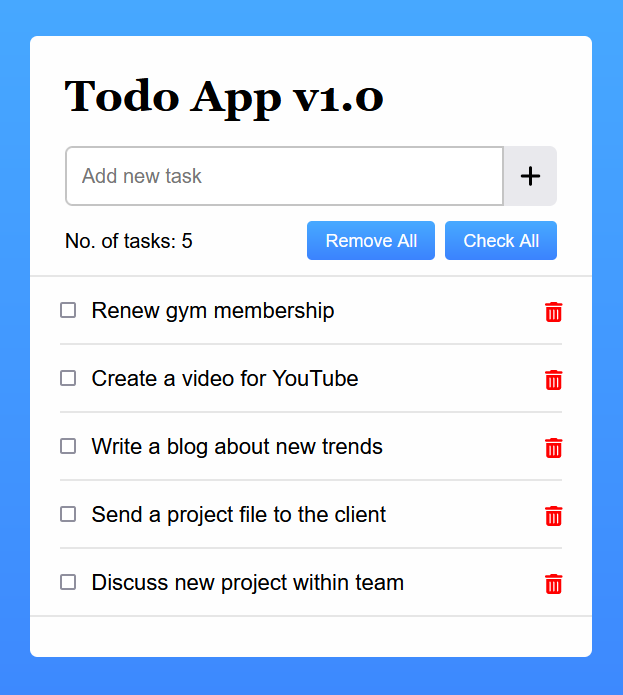

# React Todo App 🚀

A simple todo app made using React.js

## Features ✨

- Ability to add, remove and check-off todos.
- Ability to _remove all_ and _complete all_ todos at once.
- Cool design from [this website](https://www.codingnepalweb.com/create-todo-list-app-html-javascript/).

## Installation & Usage 🛠️

1. Clone the repository using `git clone https://github.com/BeanyTheCoder/react-todo-app.git`.

2. Navigate to the project directory using `cd  react-todo-app`.
3. Install dependencies with `npm install`.
4. Run the app with `npm run dev`.

## Screenshots 📷

## Technologies Used 🛠️

- React.js
- HTML & CSS

## License 📝

This project is licensed under the [License Name](link-to-license-file).

## Acknowledgments 🙏

Inspiration for the design from [this website](https://www.codingnepalweb.com/create-todo-list-app-html-javascript/).

## Contact 📧

For any questions or feedback, feel free to reach out to me at alexanderafoko@gmail.com.
